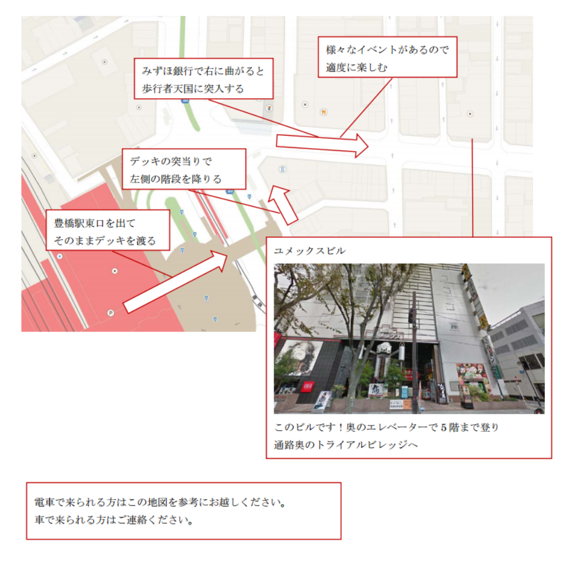

Oculus Festival in 豊橋 スタッフ向け資料
#会場

〒440-0881 愛知県豊橋市広小路1−18  
コワーキングスペース トライアルビレッジ Trial Village  
0532-35-9666  
http://www.trialvillage.jp

#スタッフ
##展示者

|展示者|内容|必要スペース|必要電源数|  
|---|---|---|---|  
|[@yunayuna64](https://twitter.com/yunayuna64)|本人来られずソフトのみ展示|||  
|[@izm](https://twitter.com/izm)|電脳フィギュア|1|1|  
|[@ta28jp](https://twitter.com/ta28jp)|マリオっぽいユニティちゃん|||
|[@kirurobo](https://twitter.com/kirurobo)|つんつんTuneちゃん|||
|[@udasan_koubou](https://twitter.com/udasan_koubou) |少女救出|	隣で説明||
|[@takane69](https://twitter.com/takane69)|VR手筒花火|隣で説明|4?|
|[@ena_wktk](https://twitter.com/ena_wktk)|うんコースター|隣で説明|0?|
|[@wyvernMurai](https://twitter.com/wyvernMurai)|未定|||
|[@minoaimino](https://twitter.com/minoaimino)|公園彼女|||
|[@tezumashi](https://twitter.com/tezumashi)|Hashilus|JOBA1台1800x900||
|[@goroman](https://twitter.com/goroman)|握手？|対面|遅れて登場|

##使えるテーブルサイズ
|サイズ|数|備考|
|---|---|---|
|600x900|9個|白|
|600x1200|2個||
|700x1400|2個||
|900x1800|1個||
|1100x3800|2個||
|450x1800|20個|会議室用|
|600x1200|4個|会議室用キャスター付き|

##お手伝い
- @AtsushiTheTramp
- @HiroseTakuya
- @3taroid
- @t_itamiya(OculusRift貸与)
- @Qman
- @toyshill_TSU
- @tyranusll(もぐらゲームス取材)
- トラビレスタッフ/関係者

##お手伝いの方の役割
- 展示代行
- 行列整理
- 会場までの案内
- 整理券配布
- アンケート配布回収
- 事前注意点

記入漏れ・空欄・修正が必要な方はご連絡くださいありましたらご連絡ください！

#スケジュール
2014.05.31  
	 
- 設営準備(トラビレ親睦会最中)

2014.06.01

- 09:00	搬入開始(ここから開始時間まで出展者が他の方の作ったコンテンツを体験できる時間とします)
- 11:00	昼食打ち合わせ(お弁当提供@TrialVillage)
- 12:00	体験開始
- ??:??	随時休憩
- 17:00	イベント終了(予定)
- 18:00	この時間くらいまでを目処に撤収→有志で打ち上げ？

#その他展示に際しての主催者からのお願い
混み具合にもよりますが、短時間で体験できるようなコンテンツだと回転率も上がりますし、酔いにくいかと思います。　　

お手伝いの方に交代で展示代行していただけるように、展示者の方はマニュアル等用意していただけるとスムーズに出来ると思います。　　

当日機材トラブルの可能性もありますので予備機の用意もできると助かります。　　

会場内の会議室がホコ天イベントで有名人？の更衣室として使われますので、出入りの際、休憩も兼ねて一時的に入場を止めることがあります。　　

#関連ページ
- 展示コンテンツプレビューtumblr 
http://ocufestoyohashi.tumblr.com/

- ocufes 公式ページ http://www.ocufes.jp/2014/05/666/
- 連絡先　[@takane69](https://twitter.com/takane69)
